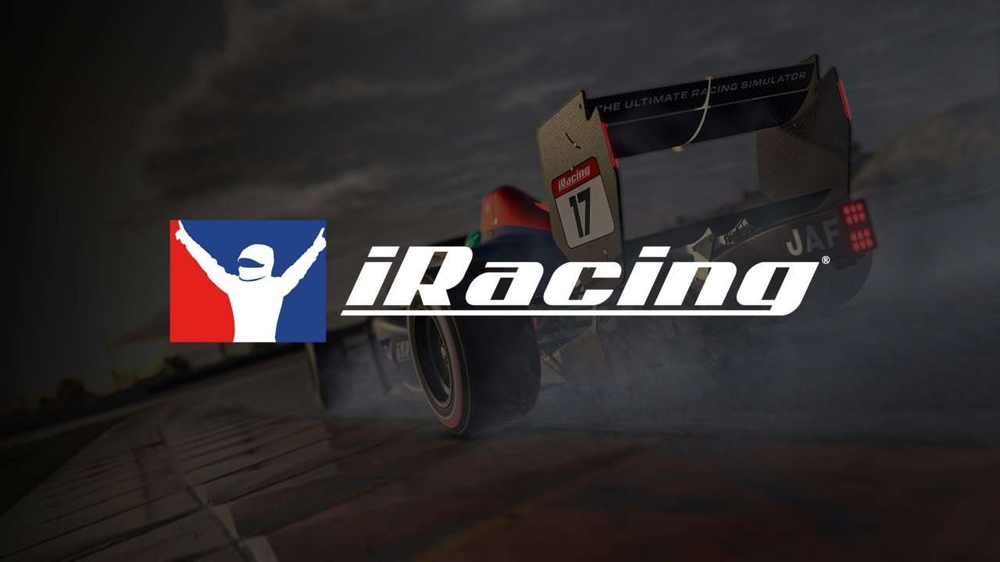

# iRacing 遥测分析 Skill

<p align="center">
  <a href="https://www.iracing.com/">
    
  </a>
</p>

<p align="center"><sub>非官方社区项目。iRacing 名称、标志及 Banner 图片归 iRacing.com Motorsport Simulations, LLC 所有。</sub></p>

这是一个符合开放 [Agent Skills](https://agentskills.io/) 目录规范的遥测分析技能，可供 Codex、Claude Code 以及其他能够读取 `SKILL.md` 的 Agent 使用。

它会将玩家的 iRacing `.ibt` 遥测与高手参考 `.csv` 对齐，生成一份可离线打开、支持逐弯切换的交互式 HTML 分析报告。

## 主要功能

- 自动选择玩家最快的完整干净圈。
- 按 `LapDistPct` 对齐玩家圈和高手参考圈。
- 使用真实 GPS 坐标比较两条行车线路。
- 从 IBT 元数据读取赛道、车辆、圈速和官方弯道数量。
- 根据高手方向盘峰值自动识别弯道，并允许手工覆盖弯心。
- 分析每个弯的入弯速度、最低速度和平均速度。
- 比较刹车点、峰值刹车、刹车持续时间、油门恢复点、档位、方向盘和 G 值。
- 统计 ABS 触发次数和持续时间，识别持续介入或反复触发。
- 自动生成桌面端和手机端均可使用的离线 HTML 报告。
- 所有对比图统一使用：玩家红色实线，高手绿色虚线。

## Agent 兼容性

Skill 核心位于：

```text
analyze-iracing-telemetry/
├── SKILL.md
├── scripts/
│   └── analyze_telemetry.py
├── references/
│   └── interpretation.md
└── agents/
    └── openai.yaml
```

`SKILL.md`、`scripts/` 和 `references/` 是通用部分。`agents/openai.yaml` 仅用于增强 Codex 中的名称、描述和默认提示词，其他 Agent 可以直接忽略。

| 使用环境 | 接入方式 |
| --- | --- |
| Codex | 使用 Skill Installer，或复制到 Codex 的 skills 目录 |
| Claude Code | 复制到用户级或项目级 `.claude/skills/` 目录 |
| 其他 Agent Skills 客户端 | 导入整个 `analyze-iracing-telemetry` 目录 |
| 不支持 Agent Skills 的 Agent | 让 Agent 先读取 `SKILL.md`，再运行分析脚本 |

## Codex 安装

让 Codex 执行：

```text
使用 $skill-installer 安装：
https://github.com/ikele123123/analyze-iracing-telemetry/tree/main/analyze-iracing-telemetry
```

安装后，在新的 Codex 会话中调用：

```text
使用 $analyze-iracing-telemetry 分析我的 IBT 和高手参考 CSV，并生成逐弯交互式 HTML 报告。
```

## Claude Code 安装

用户级安装示例：

```powershell
$Target = Join-Path $env:USERPROFILE '.claude\skills\analyze-iracing-telemetry'
New-Item -ItemType Directory -Path (Split-Path $Target) -Force
Copy-Item -LiteralPath '.\analyze-iracing-telemetry' -Destination $Target -Recurse
```

也可以复制到当前项目的：

```text
.claude/skills/analyze-iracing-telemetry/
```

然后要求 Claude Code 使用 `analyze-iracing-telemetry` Skill 分析遥测。

## 其他 Agent Skills 客户端

将整个目录导入该 Agent 的 Skill 搜索路径：

```text
analyze-iracing-telemetry/
```

不要只复制 `SKILL.md`，因为它还会调用：

- `scripts/analyze_telemetry.py`
- `references/interpretation.md`

具体安装目录由各个 Agent 决定，但入口始终是 `analyze-iracing-telemetry/SKILL.md`。

## 不支持 Skills 的通用 Agent

可以直接提供以下提示词：

```text
请先完整读取 analyze-iracing-telemetry/SKILL.md，按照其中流程执行。
需要解释遥测结论时，再读取 references/interpretation.md。
优先运行 scripts/analyze_telemetry.py，不要重新手写遥测解析器。
```

即使 Agent 不支持 Skill 自动发现，只要能读取文件并运行 Python，也能使用完整分析流程。

## Python 环境

建议使用 Python 3.10 或更高版本：

```powershell
python -m pip install -r requirements.txt
```

主要依赖：

- `pyirsdk`
- `numpy`
- `pandas`
- `scipy`
- `plotly`
- `PyYAML`

## 直接运行分析器

如果工作目录中只有一个 `.ibt`，并且根目录或 `references/` 中只有一个 `.csv`：

```powershell
python .\analyze-iracing-telemetry\scripts\analyze_telemetry.py `
  --workdir "E:\telemetry-session"
```

明确指定输入文件：

```powershell
python .\analyze-iracing-telemetry\scripts\analyze_telemetry.py `
  --ibt "E:\telemetry-session\player.ibt" `
  --reference "E:\telemetry-session\references\expert.csv" `
  --output "E:\telemetry-session\telemetry_analysis_report.html"
```

常用覆盖参数：

```powershell
# 参考文件名中没有圈速
--reference-time "1:35.229"

# 覆盖 IBT 中的官方弯道数量
--corner-count 14

# 覆盖自动弯心识别，数值为 LapDistPct
--corner-centers "0.11,0.20,0.28"
```

## 参考 CSV 字段

分析器适配 Garage 61 风格的导出文件，至少需要：

```text
Speed, LapDistPct, Lat, Lon, Brake, Throttle, RPM,
SteeringWheelAngle, Gear, LatAccel, LongAccel, YawRate
```

`ABSActive` 是可选字段。缺少该字段时，报告会把高手 ABS 状态视为不可用或未触发。

## 弯道自动识别说明

自动弯道识别使用高手方向盘峰值和 IBT 的 `TrackNumTurns`。它属于启发式分析，不等同于赛道官方编号。

第一次分析新赛道时必须检查赛道图中的 T 编号。出现以下情况时，应使用 `--corner-centers`：

- 轻微弯道没有被识别；
- 一个长弯被拆成多个方向盘峰值；
- 连续 S 弯的官方编号不同；
- T 编号或分析窗口落在错误位置；
- 起终点附近的弯道发生窗口跨界。

## 隐私与数据安全

- 遥测分析在本机完成，不会自动上传 IBT 或 CSV。
- 生成的 HTML 会嵌入处理后的遥测数据，分享前应确认其中没有不希望公开的信息。
- 不要把个人 `.ibt`、参考 `.csv`、生成的 `.html`、截图、凭据或私人车辆设置提交到仓库。

## 开放规范与许可证

- Skill 目录遵循开放 Agent Skills 规范。
- 项目采用 MIT License。
